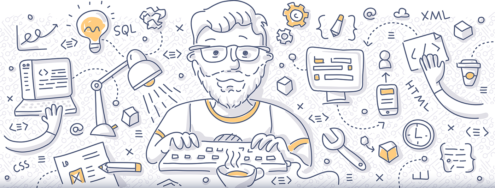

# Front End Development Resources

This is a list of curated resources on Front End developement I think are worth having a look at.

## Computer Science Fundamentals

* Computer Science Distilled: Learn the Art of Solving Computational Problems — [Book](https://www.amazon.com/Computer-Science-Distilled-Computational-Problems-ebook/dp/B0731JG96F/)
* Four Semesters of Computer Science — [Video Course](https://frontendmasters.com/courses/computer-science/) — [Course Notes](https://btholt.github.io/four-semesters-of-cs/)
* Cracking the Coding Interview — [Book](https://www.amazon.com/Cracking-Coding-Interview-Programming-Questions/dp/0984782850)
* Computer Science in JavaScript — [Website](https://www.nczonline.net/blog/tag/computer-science/)
* Itsy Bitsy Data Structures — [Website](https://github.com/thejameskyle/itsy-bitsy-data-structures)

## Computer Science Practice

* Codility — [Website](https://codility.com/programmers)
* HackerRank — [Website](https://www.hackerrank.com/dashboard)
* The Best Frontend JavaScript Interview Questions (written by a Frontend Engineer) — [Questions](https://performancejs.com/post/hde6d32/The-Best-Frontend-JavaScript-Interview-Questions-(Written-by-a-Frontend-Engineer)) — [Answers](https://github.com/bcherny/frontend-interview-questions)

## JavaScript Fundamentals

* JavaScript: The Good Parts — [Book](http://shop.oreilly.com/product/9780596517748.do)
* JavaScript: Understanding the Weird Parts — [Video Course](https://udemy.com/understand-javascript)
* JavaScript Allongé — [Book](https://leanpub.com/javascriptallongesix/read)
* Eloquent JavaScript — [Book](http://eloquentjavascript.net)
* You Don't Know JS — [Book Series](https://github.com/getify/You-Dont-Know-JS)
* JavaScript Garden — [Website](https://bonsaiden.github.io/JavaScript-Garden)
* Learning Advanced JavaScript — [Website](https://johnresig.com/apps/learn/)
* Douglas Crockford on Advanced JavaScript — [Video Course](https://yuiblog.com/blog/2006/11/27/video-crockford-advjs/)
* Learning JavaScript Design Patterns — [Book](https://addyosmani.com/resources/essentialjsdesignpatterns/book/)

## JavaScript, DOM and HTML5 APIs Practice

* 30 Day Vanilla JS Coding Challenge — [Website](https://javascript30.com/)

## Node.js

* Learn and Understand Node.js — [Video Course](https://www.udemy.com/understand-nodejs)

## Functional Programming

* Functional Programming in JavaScript — [Book](https://www.manning.com/books/functional-programming-in-javascript)
* Functional Programming in JavaScript — [Book](https://www.amazon.com/Functional-Programming-JavaScript-Dan-Mantyla/dp/1784398225)
* Functional JavaScript — [Book](http://shop.oreilly.com/product/0636920028857.do)
* Professor Frisby Introduces Composable Functional JavaScript — [Video Course](https://egghead.io/courses/professor-frisby-introduces-composable-functional-javascript)

## Testing

* JavaScript Testing — [Video Course](https://www.udacity.com/course/javascript-testing--ud549)

## HTML5

* Decoding HTML5 — [Book](https://code.tutsplus.com/ebooks/decoding-html5)

## Accessibility

* Practical Approaches For Designing Accessible Websites — [Book](https://www.amazon.com/Practical-Approaches-Designing-Accessible-Websites-ebook/dp/B014JEXKIQ/)
* Web Accessibility by Google — [Video Course](https://www.udacity.com/course/web-accessibility--ud891)
* Start Building Accessible Web Applications Today — [Video Course](https://egghead.io/courses/start-building-accessible-web-applications-today)
